<!-- README.md is generated from README.Rmd. Please edit that file -->

# sf2turbo

## Intro

-   This is an exploratory look at extracting colours from Super Street
    Fighter 2 character sprites in order to make colour palettes.
-   It’s just for fun and has some pretty serious flaws (and is also
    very inefficient)
-   Executive summary: **colours are hard**

``` r
library(tidyverse)
library(magick)
```

## Approach

### Function to visualise colours

-   Start by writing a function that allows me to visualise a vector of
    colours
-   This is for convenience and will be super useful later on

``` r
view_palette <- function(cols, lab_size = 3){
  
  n <- length(cols)
  nc <- ceiling(sqrt(n))
  nr <- ceiling(n/nc)
  n_extra <- (nc*nr) - n
  v <- col2rgb(cols) %>% rgb2hsv() %>% magrittr::extract(3,)  
  
  tidyr::crossing(x=1:nc, y=1:nr) %>% 
    dplyr::arrange(desc(y), x) %>% 
    dplyr::mutate(pal = c(cols, rep("transparent", n_extra)),
                  v = c(v, rep(NA, n_extra)),
                  lab_col = dplyr::case_when(is.na(v) ~ "transparent",
                                             v > 0.7 ~ "Black",
                                             TRUE ~ "White")) %>% 
    ggplot2::ggplot()+
    ggplot2::geom_tile(ggplot2::aes(x,y,fill=I(pal)), col=1)+
    ggplot2::geom_text(ggplot2::aes(x,y,label=pal, col=I(lab_col)), size = lab_size)+
    ggplot2::coord_equal()+
    ggplot2::theme_void()+
    ggplot2::theme(plot.caption = ggplot2::element_text(hjust = 0.5))+
    ggplot2::labs(caption = paste0(n, " colours"))
}

# Test output
view_palette(viridis::turbo(9))
```

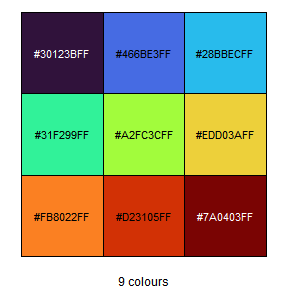<!-- -->

### Read image

-   Read a test image to develop some working code with

``` r
i <- image_read('files/vega.png')
image_ggplot(i)
```

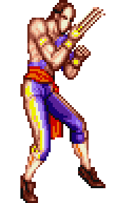<!-- -->

### Extract colours

-   Convert the image to a tidy, long format raster dataframe (removing
    transparent pixels)
-   Append the LAB colour model values in their own columns

``` r
# Convert to raster and compute LAB values
ir <-
  i %>% 
  image_raster() %>%
  as_tibble() %>% 
  filter(col != "transparent") %>% 
  transmute(col2rgb(col) %>% 
              t() %>% 
              farver::convert_colour(from = "rgb", to = "lab") %>% 
              as_tibble())
```

-   Compute the distance of each colour to every other colour
-   Use hierarchical clustering to extract 12 colours (I think these
    sprites only contain 15 colours anyway!)

``` r
clusts <- dist(ir, method = "maximum") %>% hclust(method = "complete")

# Compute colours from clusters
cols_df <-
  ir %>%
  mutate(group = cutree(clusts, k=12)) %>%
  group_by(group) %>%
  summarise(across(c(l,a,b), mean), .groups = "drop") %>%
  select(-group)

# All colours
all_cols <- cols_df %>% farver::encode_colour(from = "lab")
view_palette(all_cols)
```

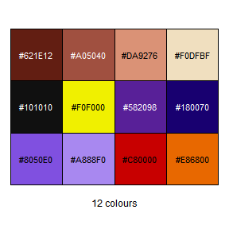<!-- -->

### Trim colours

-   Implement a very sketchy way of trimming the colours, by removing
    similar colours based on a threshold value
-   Compute the distance matrix for the colours extracted from the image
    -   Make the diagonal infinity (so it will never be below threshold)
-   Iterate through the colours removing colours that are within a
    distance threshold of the current iteration
    -   This makes the order of both the iteration and the colours
        important

``` r
d <- cols_df %>% dist(method = "maximum")
m <- as.matrix(d)
diag(m) <- Inf

# Set a threshold value
threshold <- 22

# Loop through each column of matrix and remove columns that are a similar colour
# to the current colour (based on threshold)
for(j in colnames(m)){
  if(!(j %in% colnames(m))){next}
  remove <- names(m[,j][m[,j] < threshold])
  if(all(!remove %in% colnames(m))){next}
  m <- m[, -which(colnames(m) %in% remove)]
}
```

-   View the trimmed colours

``` r
trimmed_cols <- all_cols[colnames(m) %>% as.integer()]
view_palette(trimmed_cols)
```

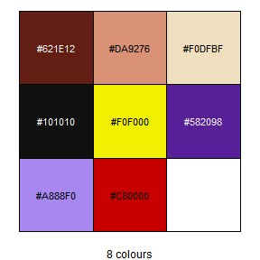<!-- -->

-   Map the closest colour in the image back to the trimmed colours
-   This should mean that the final colours contained in the palette are
    actual colours contained within the original image

``` r
trimmed_cols <-
  trimmed_cols %>%
  matrix() %>%
  image_read() %>%
  image_map(i) %>%
  image_raster() %>%
  pull(col)

view_palette(trimmed_cols)
```

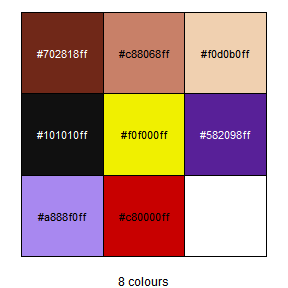<!-- -->

-   Finally, order the trimmed colours based on their frequency in the
    original image

``` r
trimmed_cols_in_order <-
  i %>% 
  image_map(image_read(matrix(c(trimmed_cols, "transparent")))) %>% 
  image_raster() %>% 
  filter(col != "transparent") %>% 
  count(col) %>% 
  arrange(desc(n)) %>% 
  pull(col)

view_palette(trimmed_cols_in_order)
```

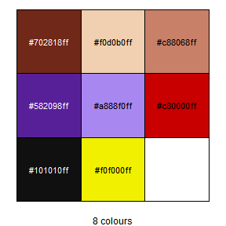<!-- -->

-   Visualise the image, the palette, and the image made only from the
    colours in the palette

``` r
# Return a visual summary
patchwork::wrap_plots(
  
  # Plot original
  image_ggplot(i) + 
    labs(subtitle = "Original")+
    theme(plot.subtitle = element_text(hjust = 0.5)),
  
  # Plot palette
  view_palette(trimmed_cols_in_order)+
    labs(subtitle = "Palette")+
    theme(plot.subtitle = element_text(hjust = 0.5)),
  
  # Plot image made from the palette
  i %>% 
    image_map(image_read(matrix(c(trimmed_cols_in_order, "transparent")))) %>% 
    image_ggplot() +
    labs(subtitle = "From palette")+
    theme(plot.subtitle = element_text(hjust = 0.5))
)
```

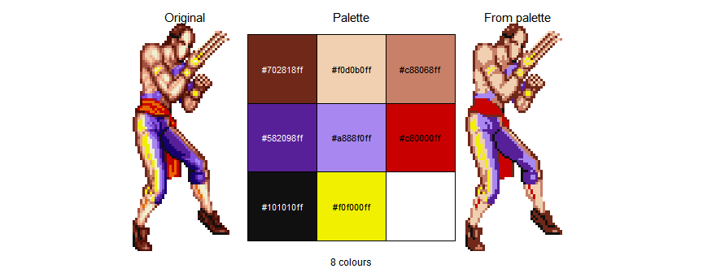<!-- -->

## Function

-   Wrap the essence of the code above into a function

``` r
make_palette <- function(img, threshold = 28, max_cols = 25, dist_method = "maximum"){
  
  # Read image
  i_original <- image_read(img)
  
  # Make image smaller if it's big - as dist() and clustering will only be possible
  # on very small images. Use image_sample to keep original colours in resizing
  if(image_info(i_original)$width > 100){
    i <- i_original %>% image_sample(geometry = "100x")
  } else {
    i <- i_original
  }
  
  # Convert to raster and compute LAB values
  ir <-
    i %>% 
    image_raster() %>%
    as_tibble() %>% 
    filter(col != "transparent") %>% 
    transmute(col2rgb(col) %>% 
                t() %>% 
                farver::convert_colour(from = "rgb", to = "lab") %>% 
                as_tibble())
    
  # Compute distances and hierarchical cluster
  clusts <- dist(ir, method = dist_method) %>% hclust(method = "complete")
  
  # Compute colours from clusters
  cols_df <-
    ir %>%
    mutate(group = cutree(clusts, max_cols)) %>%
    group_by(group) %>%
    summarise(across(c(l,a,b), mean), .groups = "drop") %>%
    select(-group)
  
  # All colours (max_cols) before trimming
  all_cols <- cols_df %>% farver::encode_colour(from = "lab")
  
  # Convert selected colours back to LAB and compute distances
  # Convert distances to matrix and make diagonal Infinity
  d <- cols_df %>% dist(method = dist_method)
  m <- as.matrix(d)
  diag(m) <- Inf

  # Loop through each column of matrix and remove columns that are a similar colour
  # to the current colour (based on threshold)
  for(j in colnames(m)){
    if(!(j %in% colnames(m))){next}
    remove <- names(m[,j][m[,j] < threshold])
    if(all(!remove %in% colnames(m))){next}
    m <- m[, -which(colnames(m) %in% remove)]
  }
  
  # Trim the colours and map colours from the original image to them
  # This should mean the colours in the final palette are colours contained in the original image
  trimmed_cols <- 
    all_cols[colnames(m) %>% as.integer()] %>% 
    matrix() %>%
    image_read() %>%
    image_map(i) %>%
    image_raster() %>%
    pull(col)
  
  # Order the trimmed colours based on how often they appar when mapped onto 
  # the original image
  trimmed_cols_in_order <-
    i %>% 
      image_map(image_read(matrix(c(trimmed_cols, "transparent")))) %>% 
      image_raster() %>% 
      filter(col != "transparent") %>% 
      count(col) %>% 
      arrange(desc(n)) %>% 
      pull(col)
  
  # Return a visual summary
  patchwork::wrap_plots(
    
    # Plot original
    image_ggplot(i_original) + 
      labs(subtitle = "Original")+
      theme(plot.subtitle = element_text(hjust = 0.5)),
    
    # Plot palette
    view_palette(trimmed_cols_in_order)+
      labs(subtitle = "Palette")+
      theme(plot.subtitle = element_text(hjust = 0.5)),
    
    # Plot image made from the palette
    i_original %>% 
      image_map(image_read(matrix(c(trimmed_cols_in_order, "transparent")))) %>% 
      image_ggplot() +
      labs(subtitle = "From palette")+
      theme(plot.subtitle = element_text(hjust = 0.5))
  )
  
}
```

### Run on sprites

-   Run the function on all sprites with default values
-   I think these sprites have less than 25 colours (the default
    cols\_max value I chose) - so its really just the colour trimming
    choosing the palettes on these examples

``` r
make_palette('files/ryu.png')
```

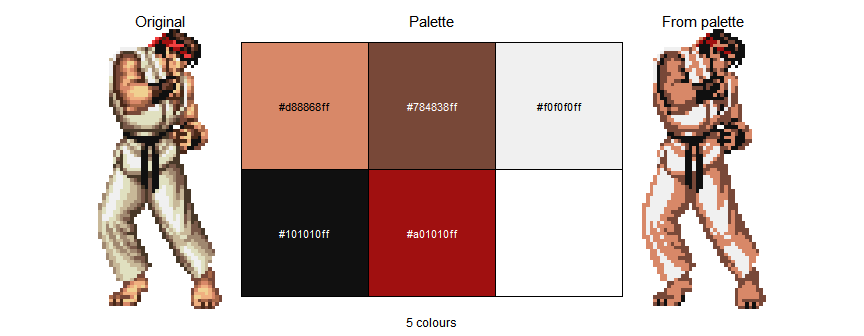<!-- -->

``` r
make_palette('files/ehonda.png')
```

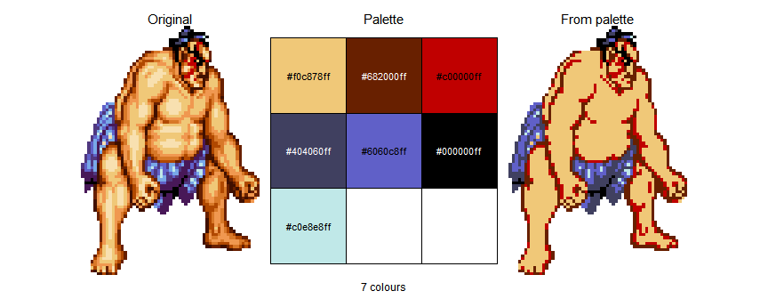<!-- -->

``` r
make_palette('files/blanka.png')
```

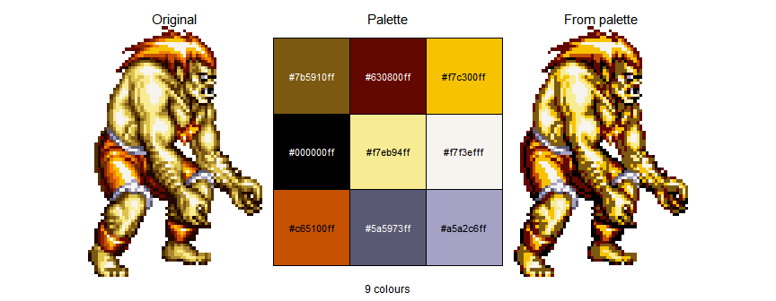<!-- -->

``` r
make_palette('files/guile.png')
```

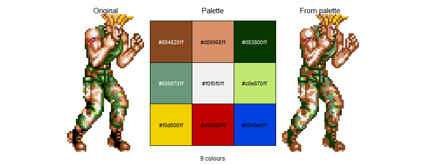<!-- -->

``` r
make_palette('files/ken.png')
```

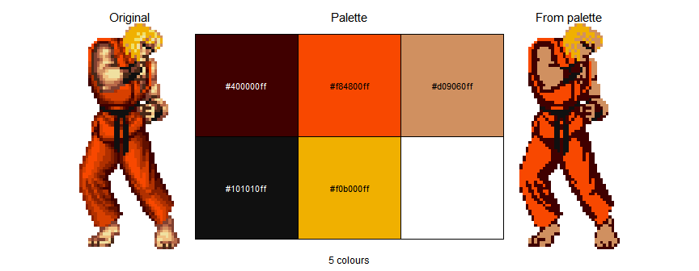<!-- -->

``` r
make_palette('files/chun-li.png')
```

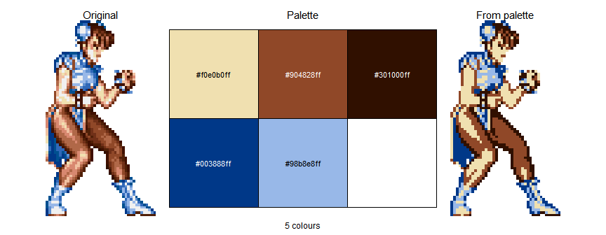<!-- -->

``` r
make_palette('files/zangief.png')
```

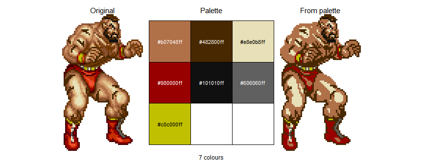<!-- -->

``` r
make_palette('files/dhalsim.png')
```

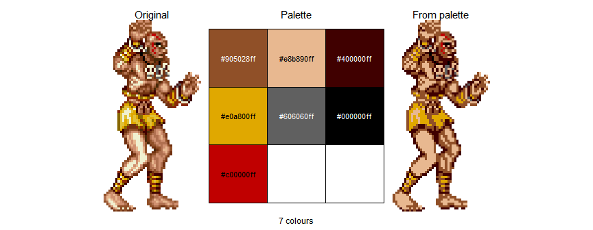<!-- -->

``` r
make_palette('files/balrog.png')
```

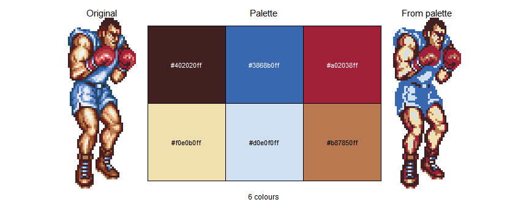<!-- -->

``` r
make_palette('files/vega.png')
```

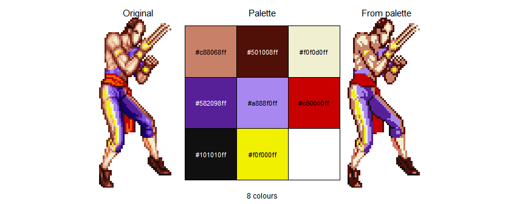<!-- -->

``` r
make_palette('files/sagat.png')
```

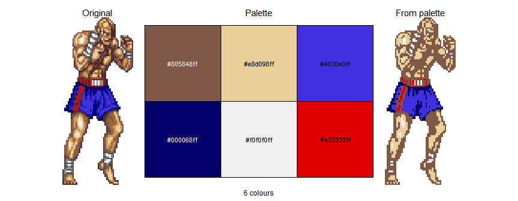<!-- -->

``` r
make_palette('files/bison.png')
```

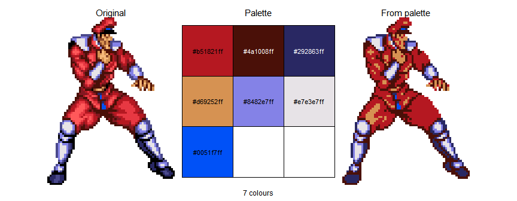<!-- -->

``` r
make_palette('files/cammy.png')
```

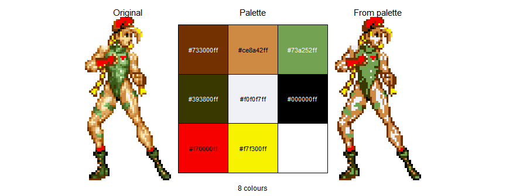<!-- -->

``` r
make_palette('files/deejay.png')
```

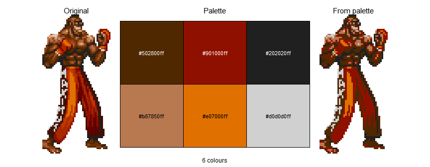<!-- -->

``` r
make_palette('files/fei-long.png')
```

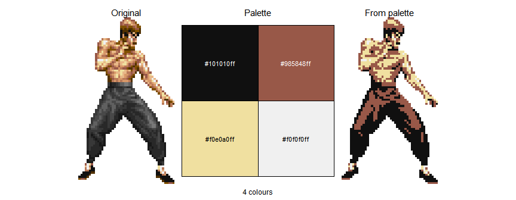<!-- -->

``` r
make_palette('files/t-hawk.png')
```

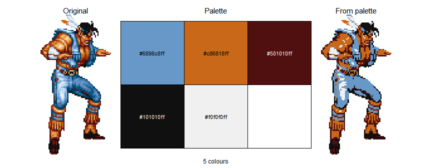<!-- -->

## Image examples

Here I compare the output of my code with some of the example colour
palettes created in the `{colorfindr}` package [readme
file](https://github.com/zumbov2/colorfindr)

``` r
make_palette('https://www.movieart.ch/bilder_xl/tintin-et-milou-poster-11438_0_xl.jpg')
```

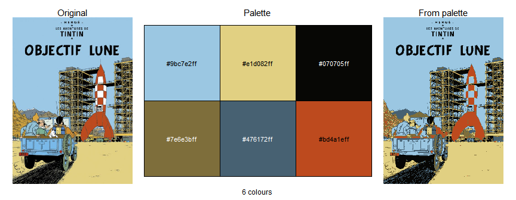<!-- -->

``` r
make_palette('http://www.coverbrowser.com/image/lucky-luke/5-1.jpg')
```

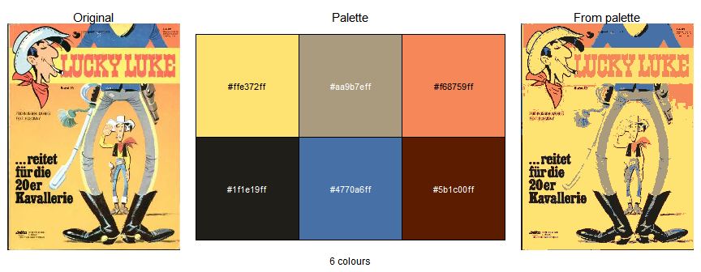<!-- -->

``` r
make_palette('http://www.gallery29.ie/images/posters/1171469398_DSC03889.jpg')
```

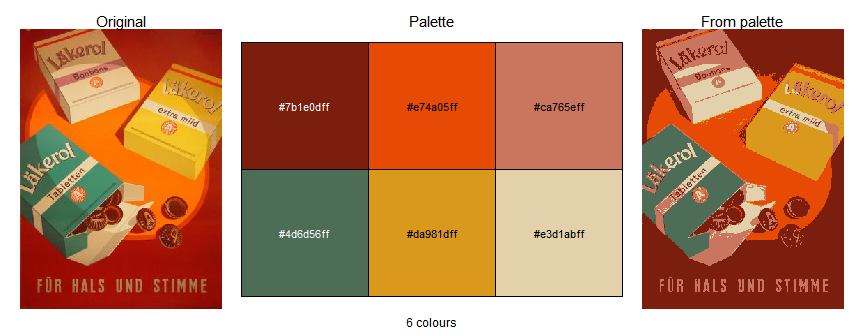<!-- -->
